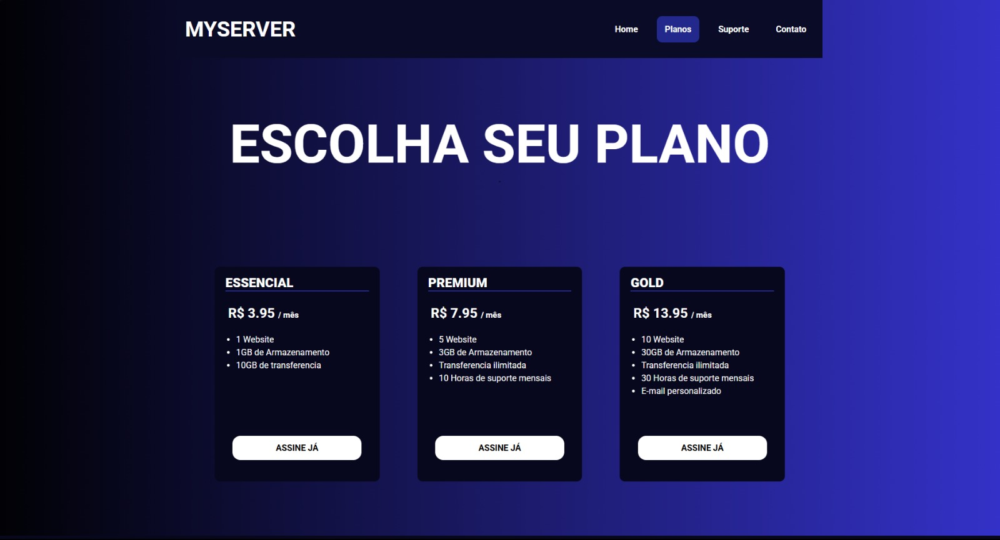

# MyServer – Página de Planos de Hospedagem


---

## Visão Geral

**MyServer** é uma página estática criada para apresentar planos de hospedagem de forma clara, moderna e responsiva.  
O objetivo é simular uma **landing page comercial**, exibindo três planos com preços, recursos e destaque visual.

Desenvolvido com **HTML e CSS puro**, priorizando organização, semântica e responsividade.

**Acesse a versão publicada:**  
https://lucascarvalho-oliveira.github.io/planos.html

---

## 🛠 Tecnologias Utilizadas

- **HTML5**
- **CSS3**
- **Google Fonts**
- **Flexbox**
- **Responsividade (Media Queries)**

---

##  Instalação

Clone o repositório:

```bash
git clone https://github.com/lucascarvalho-oliveira/planos.html.git
   ```

2. **Abra o arquivo HTML no navegador**
- Localmente: clique duas vezes em 'planos.html'
- Ou acesse a versão online: 'MyServer - GitHub Pages'

## Funcionalidades  

- Exibição de três planos de hospedagem: **Essencial**, **Premium** e **Gold** 
- Cada plano mostra:
  -  Preço mensal
  -  Recursos disponíveis
  -  Botão de assinatura
- Layout **totalmente responsivo** (desktop → celular)  
- Barra de navegação com destaque para a seção ativa
- Paleta escura com bom contraste visual
  
## Demonstração


## Análise Crítica
**Pontos Fortes:**
- Código organizado e fácil de manter
- Estrutura semântica adequada
- Responsividade bem implementada
- Estilo limpo e visual profissional

**Possíveis Melhorias Futuras:**
- IAdicionar interatividade usando JavaScript
- Criar um arquivo JSON para armazenar os planos e gerar o conteúdo dinamicamente.

## Conclusão
O projeto MyServer cumpre seu objetivo de apresentar planos de hospedagem de forma profissional e responsiva.
Ele demonstra domínio das bases de HTML e CSS, e pode servir como projeto de portfólio para iniciantes na área de desenvolvimento web.

Com pequenas expansões — como interatividade em JavaScript e integração com back-end — ele pode evoluir para um site comercial completo.

## Licença
**Autor:** Lucas Carvalho de Jesus Oliveira <br>
Email: lucascarvalhoptc06@gmail.com


