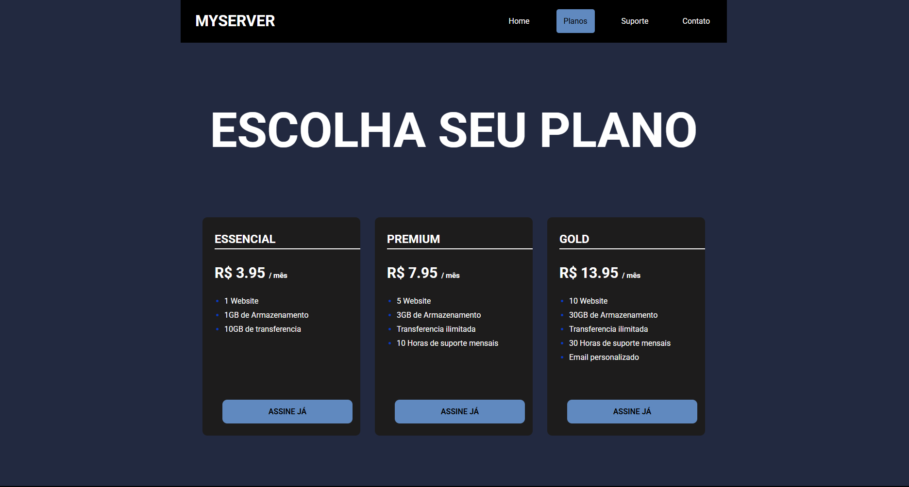

# MyServer – Página de Planos de Hospedagem  

  
  


---

## Descrição  

O projeto **MyServer** é uma página estática desenvolvida para exibir planos de hospedagem de maneira clara, moderna e responsiva.  
O objetivo é simular uma **landing page comercial** de uma empresa de hospedagem de sites, destacando planos, valores e benefícios de forma visualmente organizada.  

A interface foi criada com **HTML e CSS puro**, sem uso de frameworks, priorizando a **estrutura semântica** e o **design responsivo**.

> 🔗 Acesse o projeto publicado: [https://lucascarvalho-oliveira.github.io/planos.html](https://lucascarvalho-oliveira.github.io/planos.html)

---

## Tecnologias Utilizadas  

- **HTML5** – Estrutura e semântica da página  
- **CSS3** – Estilização e layout responsivo  
- **Google Fonts** – Tipografia (Roboto, Oswald e variações)  
- **Flexbox** – Organização e alinhamento dos elementos  

---

## Instalação  

1. **Clone o repositório**  
   ```bash
   git clone https://github.com/lucascarvalho-oliveira/planos.html.git
   ```
2. **Abra o arquivo HTML no navegador**
- Localmente: clique duas vezes em 'planos.html'
- Ou acesse a versão online: 'MyServer - GitHub Pages'

## Funcionalidades  

- Exibição de três planos de hospedagem: **Essencial**, **Premium** e **Gold** 
- Cada plano mostra:
  -  Preço mensal
  -  Recursos disponíveis
  -  Botão de assinatura
- Layout **totalmente responsivo** (ajuste automático para telas menores)  
- Barra de navegação com destaque para a seção ativa
- Paleta de cores moderna com contraste adequado

## Demonstração


## Análise Crítica
**Pontos Fortes:**
- Código limpo e organizado, com boa semântica.
- Uso correto de Flexbox e media queries para responsividade.
- Design coerente e visualmente agradável.

**Possíveis Melhorias Futuras:**
- Implementar JavaScript para tornar os botões funcionais (ex: redirecionar para uma página de checkout).
- Criar um arquivo JSON para armazenar os planos e gerar o conteúdo dinamicamente.

## Conclusão
O projeto MyServer cumpre seu objetivo de apresentar planos de hospedagem de forma profissional e responsiva.
Ele demonstra domínio das bases de HTML e CSS, e pode servir como projeto de portfólio para iniciantes na área de desenvolvimento web.

Com pequenas expansões — como interatividade em JavaScript e integração com back-end — ele pode evoluir para um site comercial completo.

## Licença
**Autor:** Lucas Carvalho de Jesus Oliveira <br>
Email: lucascarvalhoptc06@gmail.com


